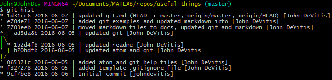

# git


## setup
1. download and install [git](https://git-scm.com/download/win)

2. create github account at github.com. git is the local tool, github integrates with git to provide
	online hosting and integration w/ others

3. configure user data - open git bash anywhere and enter:
```
git config --global user.name "John DeVitis"
git config --global user.email johndevitis@gmail.com
```

## basics
Tracked files in a git repository have three basic states:

1. __Modified__ changes have been made to a file but have not been staged for a commit yet.

2. __Staged__ a modified file has been marked to go into the next commit snapshot (git creates snapshots instead of tracking changes so we don't have to worry about losing data inmost circumstances)

3. __Committed__ the data is safely stored in the local repository

Basic workflow:
1. Modify files in working directory (work as normal). Check for any modified files with
```
git status
```

2. Stage the files with add
```
git add .
```

3. Commit to take the staged files (as they were when you added them) and store a snapshot permanently to the git directory
```
git commit -m "this is a commit message. i updated some files"
```

## helpful commands and aliases

### pretty logs
```
git log --oneline --decorate
```

graph version
```
git log --oneline --decorate --graph --all
```
this produces the following:  


Pretty, right? I like to alias it to `git logg` with the following:
```
git config --global alias.logg 'log --oneline --decorate --graph --all'
```


### git hist
Use the following alias for a quick view at the repo's history.
```
git config --global alias.hist 'log --pretty=format:"%h %ad | %s%d [%an]" --graph --date=short'
```
Typing `git hist` then produces:




### clean up untracked files.

**note:** commit any/all changes first - they *will* be lost
```
git rm -r --cached .
git add .
git commit -m "fixed untracked files"
```


## links
[download](https://git-scm.com)

[manual](https://git-scm.com/book/en/v2/Getting-Started-About-Version-Control)

[cheatsheet](https://services.github.com/kit/downloads/github-git-cheat-sheet.pdf)

[common ignore files](https://github.com/github/gitignore)
